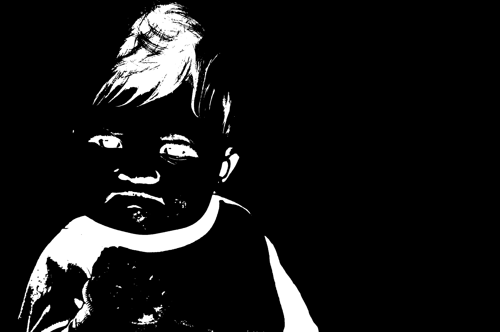

Regions of Interest Maximum Symmetric Surround Saliency Algorithm
============

## Introduction

Detection of visually salient image regions is useful for
 applications like object segmentation, adaptive compression and
 object recognition. Recently, full-resolution salient maps that
 retain well-defined boundaries have attracted attention. In these
 maps, boundaries are preserved by retaining substantially more
frequency content from the original image than older techniques.
 However, if the salient regions comprise more than half the pixels
 of the image, or if the background is complex, the background gets
 highlighted instead of the salient object.

Maximum Symmetric Surround Saliency is a method for salient region detection that retains the
 advantages of full resolution saliency maps with well-defined
 boundaries while overcoming their shortcomings. It exploits
 features of color and luminance, is simple to implement and is
 computationally efficient.

## Examples

**Success Meme Baby**

Let's look at the famous "Success!" baby photo as a quick demo of our saliency detector.

**Success Meme Baby, saliency mapped**

This is the native output of MSSS.

**Success Meme Baby, salient two colors**

Here we used the inbuilt --threshold switch to reduce the saliency map to only 2-color black and white pixels, which makes the salient regions very easy to detect programmatically.

Note how the saliency detector has successfully ignored the background as well as monotone areas in the foreground so that only detailed, multicolored areas stay as parts of the regions of interest. This way, processes like adaptive compression have an awesome basis to operate on.

## Credits

 * [Radhakrishna Achanta](http://ivrg.epfl.ch/people/achanta)
 * [Neil Jedrzejewski](http://www.wunderboy.org/about.php)
 * [Tobias Baldauf](http://who.tobias.is/)
